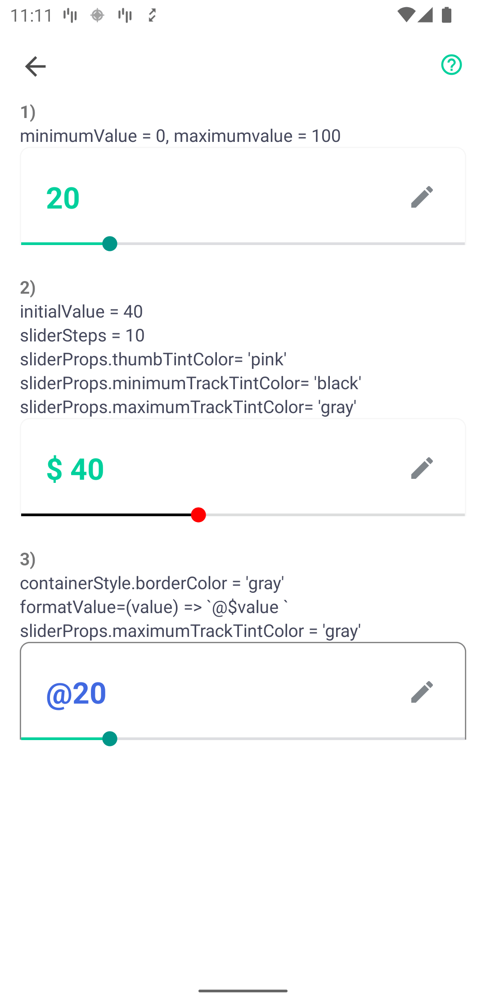
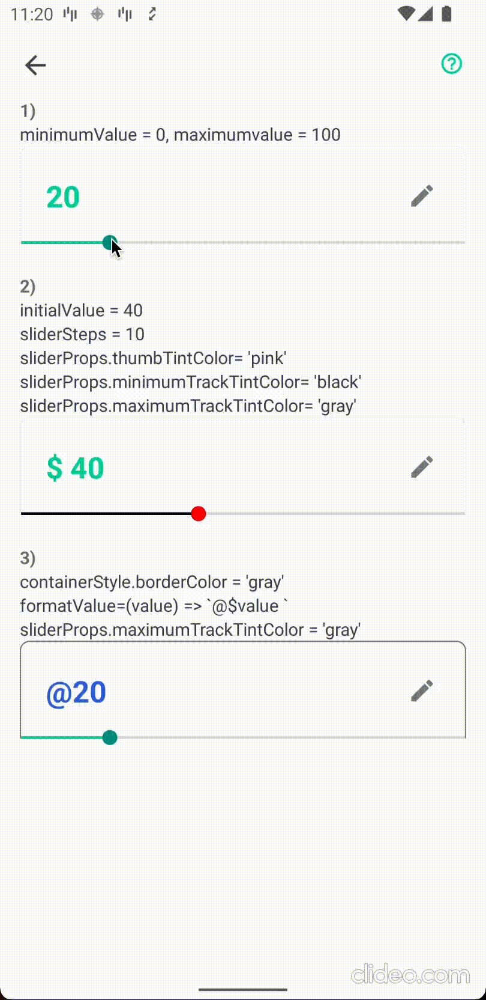
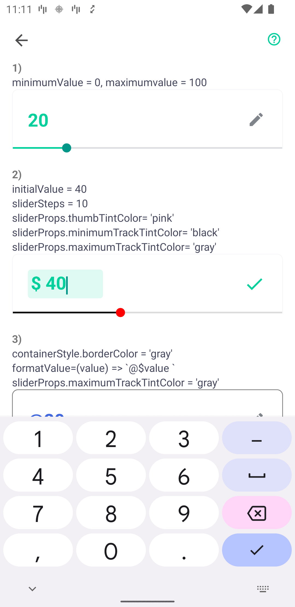

<p align="center">
  <h1 align="center"> <code>@groww-tech/editable-number-slider</code> </h1>
</p>
<p align="center">
    <!-- <a href="https://www.npmjs.com/package/@react-native-community/slider">
        
    </a> -->
    <a href="https://app.circleci.com/pipelines/github/callstack/react-native-slider?branch=main">
        
    </a>
    <a href="https://github.com/callstack/react-native-slider">
        
    </a>
    <a href="https://github.com/callstack/react-native-slider/blob/main/LICENSE.md">
        
    </a>
</p>
<p align="center">
  React Native component used to select a single value from a range of values.
  <br>It is bulit on top of @react-native-community/slider with added support of TextInput in which user can edit the slider value.
</p>

<!-- |Screenshot 1 |Screenshot 2| GIF | -->
<!-- |:-:|:-:|:-:
| | |  |  -->


<!-- https://i.ibb.co/bWMDY7b/Screenshot-1650130877.png -->
<!-- https://i.ibb.co/KmTZ2vH/Screenshot-1650130906.png -->
<!-- https://i.ibb.co/5M0CKTp/recording.gif -->

<div>
  <p align="center">| Screenshot 1 | Screenshot 2 | GIF |</p>
  
  
  
<div>

## Installation & Usage

To install this module `cd` to your project directory and enter the following command:
```
yarn add @groww-tech/editable-number-slider
```
or
```
npm install @groww-tech/editable-number-slider --save
```
If using iOS please remember to install cocoapods by running: `npx pod-install`

The following code presents the basic usage scenario of this library:
```javascript
import EditableNumberSlider from '@groww-tech/editable-number-slider';

<EditableNumberSlider
  minimumValue={0}
  maximumValue={100}
/>
```
You can pass several props to customize the component:
```javascript
import EditableNumberSlider from '@groww-tech/editable-number-slider';

<EditableNumberSlider
  minimumValue={0}
  maximumValue={100}
  initialValue={40}
  sliderProps={
    disabled: false,
    thumbTintColor: 'red',
    minimumTrackTintColor: 'black',
    maximumTrackTintColor: 'gray',
  }
  prefix={'$ '}
  sliderStep={10}
  labelColor={'#ff00ff'}
  labelErrorColor={'#ff0000'}
  nativeRipple={false}
/>
```

<!-- Check out the [example project](example) for more examples. -->


## Properties

| Property | Description | Type | Required | Platform |
| -------- | ----------- | ---- | -------- | -------- |
| `maximumValue` | Initial maximum value of the slider.<br/>Default value is 1. | number | Yes | |
| `minimumValue` | Initial minimum value of the slider.<br/>Default value is 0. | number | Yes | |
| `sliderStep` | Step value of the slider. The value should be between 0 and (maximumValue - minimumValue). Default value is 1 | number | No | |
| `onValueChange` | Callback continuously called while the user is dragging the slider. | function | No | |
| `disabled`| If true the user won't be able to move the slider.<br/>Default value is false. | bool | No | |
| `containerStyle` | Custom style for container. | style | No | |
| `editable` | boolean for making text input editable. Default: True | boolean | No | |
| `rightElement` | Custom component for the edit/done button | component| No | |
| `onEditStart` | Callback called when editing starts | Function | No | |
| `onEdit` | Callback called when editing is done | Function | No | |
| `absoluteMinima` | Needed to protect slider going to a number below minimum in case of a flick | number | No | |
| `formatValue` | Show custom string instead of just numerical value of slider. Accepts value as parameter | Function | No | |
| `labelColor` | Custom color for label | color(in hex) | No | |
| `lableErrorColor` | Custom color for when label value is incorrect | color(in hex) | No | |
| `nativeRipple` | Choose whether ripple for editable component should be nativeRipple. Default: true | boolean | No | |
| `sliderProps` | Custom Slider Props <br> customThumb?: string, <br> minimumTrackTintColor?: string; <br> maximumTrackTintColor?: string; <br> thumbTintColor?: string; <br> disabled?: boolean; <br> onSlidingStart?: Function <br> onSlidingComplete?: Function; <br> | object | No | |


## Made with ❤️ at Groww
